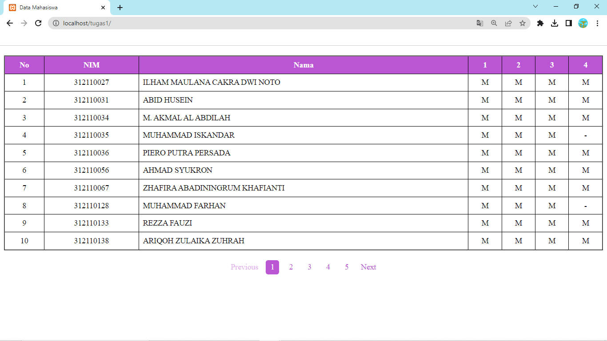
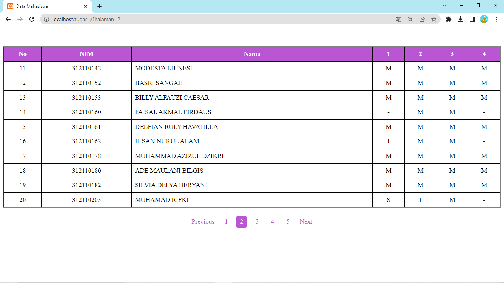
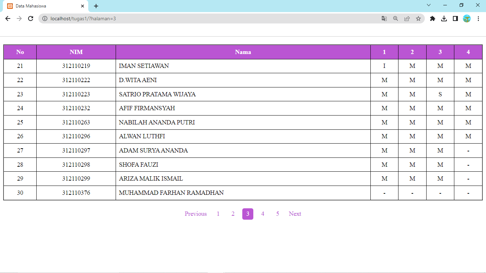
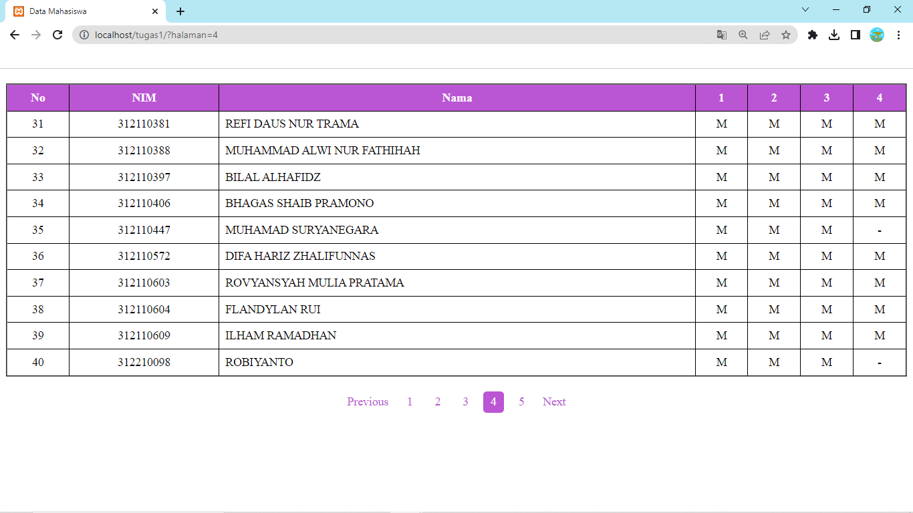
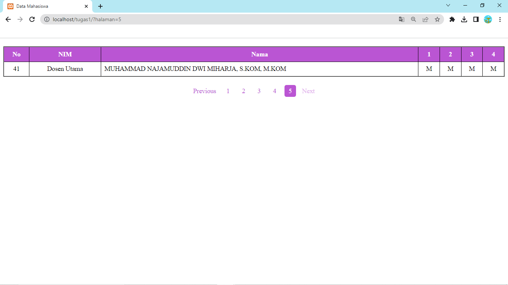

## Profil
| #               | Biodata                      |
| --------------- | ---------------------------- |
| **Nama**        | Muhammad Alwi Nur Fathihah   |
| **NIM**         | 312110388                    |
| **Kelas**       | TI.21.A.1                    |
| **Mata Kuliah** | Pemrograman Mobile 2         |

## Codingan

1. Index.php

```php
<!DOCTYPE html>
<html lang="en">

<head>
    <meta charset="UTF-8">
    <meta http-equiv="X-UA-Compatible" content="IE=edge">
    <meta name="viewport" content="width=device-width, initial-scale=1.0">
    <link rel="stylesheet" href="style.css">
    <title>Data Mahasiswa</title>
</head>

<body>

    <?php

    $data_per_halaman = 10;

    $data = file_get_contents('https://api.steinhq.com/v1/storages/642a1ee5eced9b09e9c762e8/21a1');
    $data = json_decode($data, true);

    $jumlah_halaman = ceil(count($data) / $data_per_halaman);

    if (!isset($_GET['halaman'])) {
        $halaman_aktif = 1;
    } else {
        $halaman_aktif = $_GET['halaman'];
    }

    $batas_data = $data_per_halaman * $halaman_aktif;
    $mulai_data = $batas_data - $data_per_halaman;
    $nomor_urut = $mulai_data + 1;

    echo "<table border ='2' align='center'>";
    echo "<tr><th>No</th><th>NIM</th><th>Nama</th><th>1</th><th>2</th><th>3</th><th>4</th></tr>";
    foreach (array_slice($data, $mulai_data, $data_per_halaman) as $item) {
        echo "<tr>";
        echo "<td>" . $nomor_urut . "</td>";
        echo "<td>" . $item['NIM'] . "</td>";
        echo "<td>" . $item['Nama'] . "</td>";
        echo "<td>" . $item['1'] . "</td>";
        echo "<td>" . $item['2'] . "</td>";
        echo "<td>" . $item['3'] . "</td>";
        echo "<td>" . $item['4'] . "</td>";
        echo "</tr>";
        $nomor_urut++;
    }
    echo "</table>";

    echo "<div class='pagination'>";
    if ($jumlah_halaman > 1) {
        if ($halaman_aktif > 1) {
            echo "<a href='?halaman=" . ($halaman_aktif - 1) . "'>Previous</a>";
        } else {
            echo "<a class='disabled'>Previous</a>";
        }

        for ($i = 1; $i <= $jumlah_halaman; $i++) {
            if ($i == $halaman_aktif) {
                echo "<a class='active'>" . $i . "</a>";
            } else {
                echo "<a href='?halaman=" . $i . "'>" . $i . "</a>";
            }
        }

        if ($halaman_aktif < $jumlah_halaman) {
            echo "<a href='?halaman=" . ($halaman_aktif + 1) . "'>Next</a>";
        } else {
            echo "<a class='disabled'>Next</a>";
        }
    }
    echo "</div>";

    ?>

</body>
</html>
```

2. style.css

```css
table {
  border-collapse: collapse;
  width: 100%;
  margin-top: 20px;
}

th,
td {
  text-align: center;
  padding: 8px;
}

th {
  background-color: #BA55D3;
  color: white;
}

td:nth-child(3) {
  text-align: left;
}

td:nth-child(1),
td:nth-child(n+4) {
  text-align: center;
}

.pagination {
  display: flex;
  justify-content: center;
  align-items: center;
  margin-top: 20px;
}

.pagination a {
  color: #BA55D3;
  padding: 5px 10px;
  margin: 0 5px;
  border-radius: 5px;
  text-decoration: none;
  background-color: white;
}

.pagination a.active {
  background-color: #BA55D3;
  color: white;
}

.pagination a:hover:not(.active) {
  background-color: #BA55D3;
  color: white;
}

.pagination a:first-child,
.pagination a:last-child {
  margin: 0;
}

.pagination a.disabled {
  pointer-events: none;
  opacity: 0.5;
}

td,
th {
  border: 1px solid black;
}
```

## Tampilan










